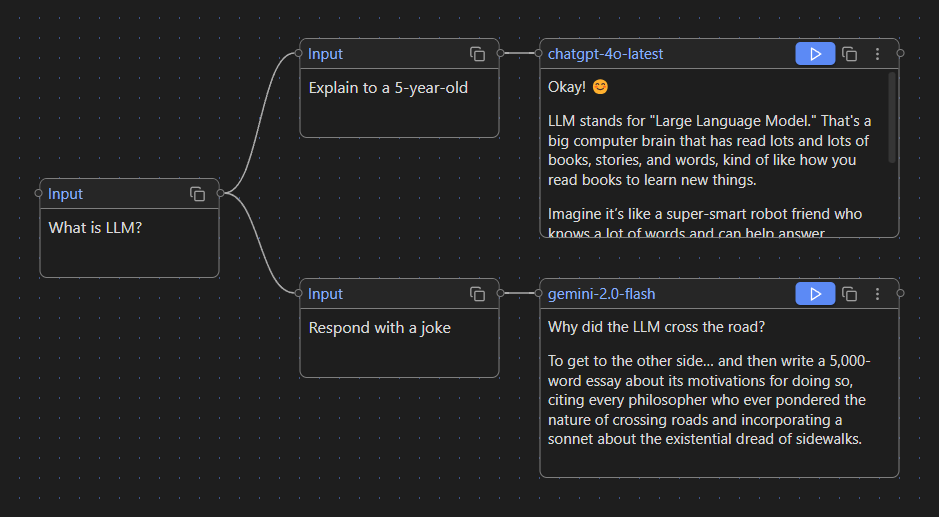
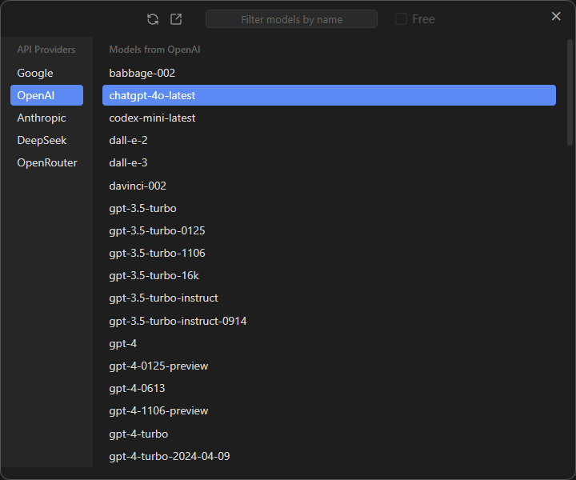
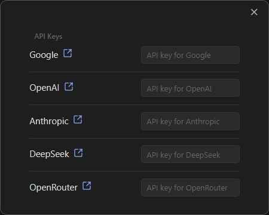

# A Canvas-like UI to Talk with LLMs in Obsidian

We’re all used to interacting with Large Language Models (LLMs) through chats.

Let me introduce an alternative: a canvas-like UI.

Take a look at this screenshot — this graph represents two separate chat branches:

### Branch 1:

**<ins>User:</ins>** 
> What is LLM?

**<ins>User:</ins>** 
> Explain to a 5-year-old 

**<ins>Model:</ins>** 
> Okay! 😊 LLM stands for "Large Language Model." That's a big computer brain that has read lots and lots of books, stories, and words, kind of like how you read books to learn new things.

### Branch 2:

**<ins>User:</ins>** 
> What is LLM?

**<ins>User:</ins>** 
> Respond with a joke 

**<ins>Model:</ins>** 
> Why did the LLM cross the road? To get to the other side… and then write a 5,000-word essay about its motivations for doing so, citing every philosopher who ever pondered the nature of crossing roads and incorporating a sonnet about the existential dread of sidewalks.

As you can see, Canvas LLM provides a visual way to interact with LLMs using branching conversations.

# Model Selection

You can also choose a different model for each block.

# API Providers

The current version supports five API providers, and you'll need your own API keys to use them.

# Installation

1. Download [latest release](https://github.com/farlenkov/obsidian-canvas-llm/releases/latest).
2. Copy files `main.js`, `styles.css`, `manifest.json` to your Obsidian plugins directory: `vault/.obsidian/plugins/obsidian-canvas-llm`
4. Enable the plugin in Obsidian → Settings → Community Plugins → Installed plugins → Canvas LLM.
