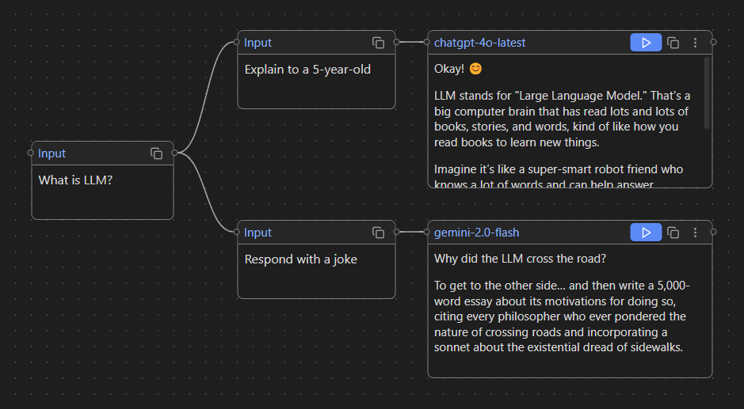
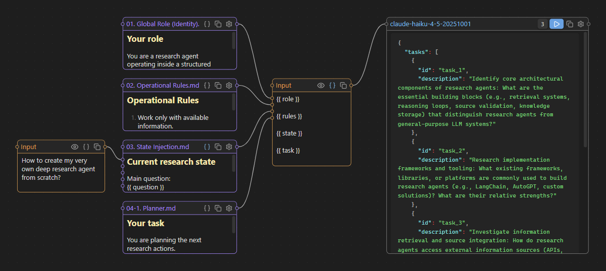

# A Canvas-like UI to Talk with LLMs in Obsidian

We are all used to interacting with Large Language Models (LLMs) through traditional chat interfaces.

Let me introduce an alternative: a canvas-like UI.

As you can see in the screenshot above, you can type prompts into `Input` cards and trigger LLM responses in `Generate` cards. This example graph shows two separate chat branches:
### Branch 1:

**<ins>User:</ins>** 
> What is LLM?

**<ins>User:</ins>** 
> Explain to a 5-year-old 

**<ins>Model:</ins>** 
> Okay! 😊 LLM stands for "Large Language Model." That's a big computer brain that has read lots and lots of books, stories, and words, kind of like how you read books to learn new things.
### Branch 2:

**<ins>User:</ins>** 
> What is LLM?

**<ins>User:</ins>** 
> Respond with a joke 

**<ins>Model:</ins>** 
> Why did the LLM cross the road? To get to the other side… and then write a 5,000-word essay about its motivations for doing so, citing every philosopher who ever pondered the nature of crossing roads and incorporating a sonnet about the existential dread of sidewalks.

As you can see, Canvas LLM provides a visual, non-linear way to interact with LLMs using branching conversations. This is especially useful for complex research projects, where navigating through a traditional chat UI becomes inefficient and overwhelming.
## Features
### ⌨️ Text Input Node
Node for basic text prompts.
### 📄 File Input Node
Node for file attachment.
Currently supported file types: `.md`, `.canvas`, `.docx`, `.fountain`.
### 🌐 Web Input Node
Embedded browser to extract and use web content in your prompt flow.
### ⚡ Generate Node
Node to actually call LLM.

You can choose different model for each node.

You'll need your own API keys to use them. But don't worry — some providers, like [Google](https://ai.google.dev/gemini-api/docs/pricing), [OpenRouter](https://openrouter.ai/models?max_price=0) and [SambaNova](https://cloud.sambanova.ai/plans/pricing), offer free models.

**Supported providers:**  
Alibaba, Anthropic, DeepSeek, Google, Groq, Ollama, OpenAI, OpenRouter, SambaNova, xAI.
### 🧩 Template Mode
Use `{{ input }}` placeholders in `Text input` and `File input` nodes to create dynamic input handles.

## Mode Screenshots

Example of use `File input` node and `Template` mode:

## Installation
### From Community Plugins
1. Open Obsidian → `Settings` → `Community Plugins` → `Browse`.
2. Search for `"Canvas LLM"`.
3. Install and enable.
### Manual
1. Download [latest release](https://github.com/farlenkov/obsidian-canvas-llm/releases/latest) (files `main.js`, `styles.css`, `manifest.json`).
2. Copy this files to your Obsidian plugins directory: `vault/.obsidian/plugins/canvas-llm`.
3. Enable the plugin in Obsidian → `Settings` → `Community Plugins` → `Canvas LLM`.
## Credits
Canvas LLM is powered by [Svelte Flow](https://svelteflow.dev) from [xyflow](https://xyflow.com).
## License
This project is licensed under the GPL-3.0 license - see the LICENSE file for details.
