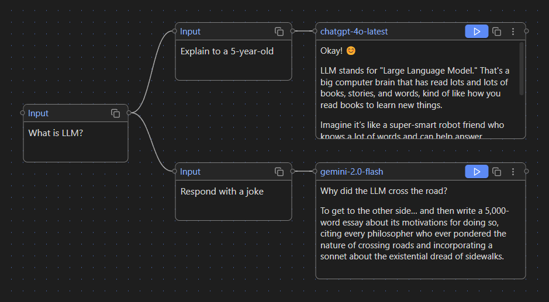
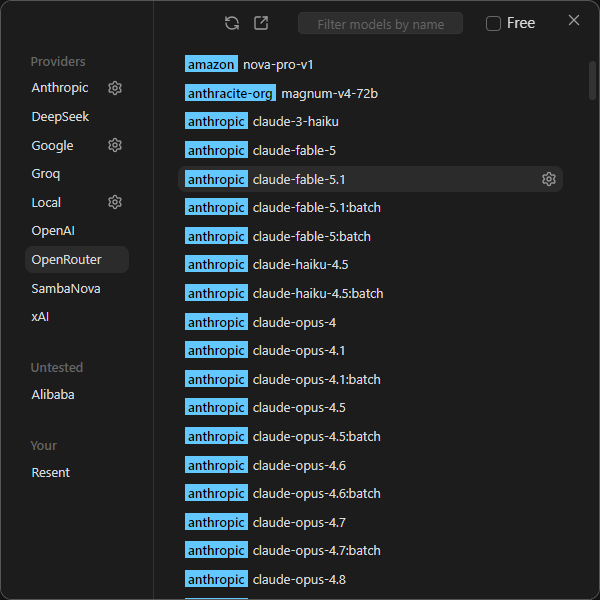
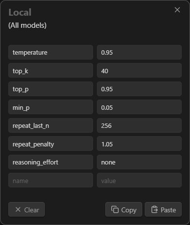
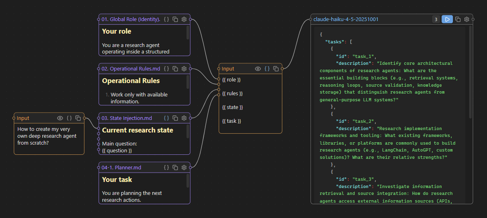
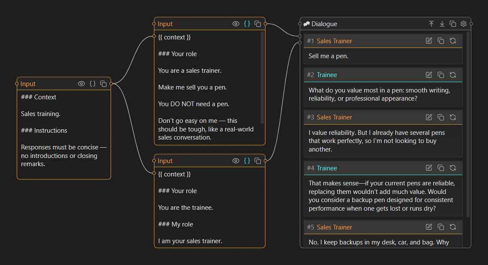

# A Canvas-like UI to Talk with LLMs in Obsidian

We are all used to interacting with Large Language Models (LLMs) through traditional chat interfaces.

Let me introduce an alternative: a canvas-like UI.



As you can see in the screenshot above, you can type prompts into `Input` cards and trigger LLM responses in `Generate` cards. This example graph shows two separate chat branches:

### Branch 1:

**<ins>User:</ins>** 
> What is LLM?

**<ins>User:</ins>** 
> Explain to a 5-year-old 

**<ins>Model:</ins>** 
> Okay! 😊 LLM stands for "Large Language Model." That's a big computer brain that has read lots and lots of books, stories, and words, kind of like how you read books to learn new things.

### Branch 2:

**<ins>User:</ins>** 
> What is LLM?

**<ins>User:</ins>** 
> Respond with a joke 

**<ins>Model:</ins>** 
> Why did the LLM cross the road? To get to the other side… and then write a 5,000-word essay about its motivations for doing so, citing every philosopher who ever pondered the nature of crossing roads and incorporating a sonnet about the existential dread of sidewalks.

As you can see, Canvas LLM provides a visual, non-linear way to interact with LLMs using branching conversations. This is especially useful for complex research projects, where navigating through a traditional chat UI becomes inefficient and overwhelming.

## Features
### ⌨️ Text Input Node

Node for basic text prompts.

### 📄 File Input Node

Node for file attachment.
Currently supported file types: `.md`, `.canvas`, `.docx`, `.fountain`.

### 🌐 Web Input Node

Embedded browser to extract and use web content in your prompt flow.

### ⚡ Generate Node

Node to actually call LLM.

You can choose different model for each node.

You'll need your own API keys to use them. But don't worry — some providers, like [Google](https://ai.google.dev/gemini-api/docs/pricing), [OpenRouter](https://openrouter.ai/models?max_price=0) and [SambaNova](https://cloud.sambanova.ai/plans/pricing), offer free models. Local runtimes and some providers may not require an API key.

**Supported providers:**  
Alibaba, Anthropic, DeepSeek, Google, Groq, OpenAI, OpenRouter, SambaNova, xAI, and custom endpoints compatible with the OpenAI Chat Completions API.

### 💬 Dialogue Node

Node for simulating dialogues between a **user** and a **model** or between **two models**.

In **User ↔ Model** mode, you can edit the model's system prompt and choose who starts the conversation.

In **Model ↔ Model** mode, each model has its own system prompt defining its role and behavior.

Models can also use **hidden memory** to store private notes that remain **visible** only to themselves and **hidden** from their conversation partner.

### 🧩 Template Mode

Use `{{ input }}` placeholders in `Text input` and `File input` nodes to create dynamic input handles.

### 📡 Model Context Protocol (MCP) Support (experimental)

Use any MCP-compatible server to give your AI access to external tools, services, and data sources such as Slack, Jira, GitHub, and more. You can add your MCP configs (Claude Desktop compatible) to `.obsidian/plugins/canvas-llm/data.json` by editing block `mcpServers`:

```json
{
    "mcpServers": {
        ...put your MCP configs here..
    }
}
```

## Local Runtimes

Canvas LLM can connect to local LLM runtimes. The following runtimes have been tested:

- [llama.cpp](https://github.com/ggml-org/llama.cpp)
- [LM Studio](https://lmstudio.ai/)
- [Ollama](https://ollama.com/)

Other OpenAI-compatible local runtimes may also work, but have not been tested officially.

## More Screenshots

Model selection:



Model parameters:



Example of use `File input` node and `Template` mode:



Example of use `Dialogue` node:



## Installation
### From Community Plugins

1. Open Obsidian → `Settings` → `Community Plugins` → `Browse`.
2. Search for `"Canvas LLM"`.
3. Install and enable.

### Manual

1. Download [latest release](https://github.com/farlenkov/obsidian-canvas-llm/releases/latest) (files `main.js`, `styles.css`, `manifest.json`).
2. Copy this files to your Obsidian plugins directory: `vault/.obsidian/plugins/canvas-llm`.
3. Enable the plugin in Obsidian → `Settings` → `Community Plugins` → `Canvas LLM`.

## Credits

Canvas LLM is powered by [Svelte Flow](https://svelteflow.dev) from [xyflow](https://xyflow.com).

## License

This project is licensed under the GPL-3.0 license - see the LICENSE file for details.